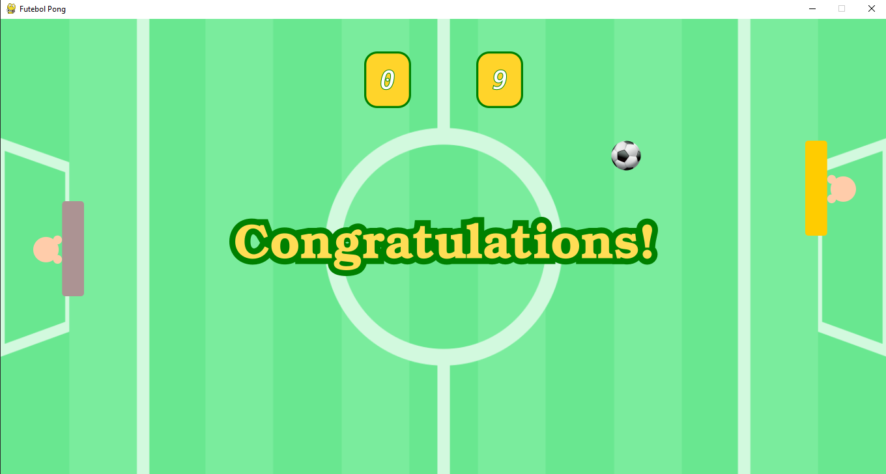

<h1>Futebol Pong</h1>
<h3>Game do Pong, feito com Python 3, com a temática de futebol</h3>

Este projeto foi feito utilizando a biblioteca PyGame

<b>Observação:</b>  Apenas o player 1 é jogável --> Use as teclas W e S

